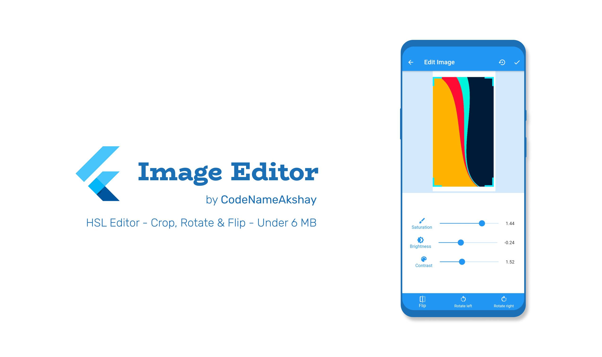

# 
 Flutter Image Editor

This is a beautiful open-source image-editing app for Android/iOS. It is built with Dart on top of Google's Flutter Framework.

This app offers image editing features like Saturation, Brightness, Crop, Contrast, Rotation & Flip in an easy-to-use minimalistic approach. It can export the edited images in high quality, or directly share them to other apps like WhatsApp, Twitter, Instagram, etc.

## List of Contents

1. [Features](#features)
2. [Demo](#demo)
3. [Support](#support)
4. [Dependencies](#dependencies)
5. [Contributing](#contributing)
6. [License](#license)
7. [Contributors](#contributors)

## Features

- High-Quality Exports
- Edit images easily, with beautiful UI
- Edit features like Saturation, Brightness & Contrast
- Crop, Rotate and Flip images to match your perspective
- Offline App (Needs no internet connection)
- Saves images to gallery directly, for easy viewing
- Minimal design with smooth transitions and animations
- Optimized storage using minimal packages
- Application size under 6 MB

